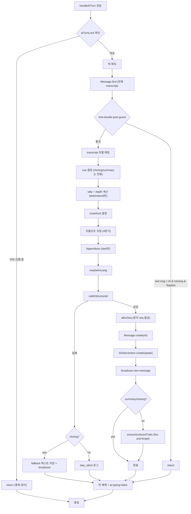

# handleAITurn — AI 발화 실행 함수

> **위치:** `server/src/lib/aiTurn.ts`
> **역할:** `maybeAITurn`의 게이트를 통과한 후, 실제 LLM 호출 → DB 저장 → broadcast을 수행하는 최하위 실행 함수.

---

## 시그니처

```ts
async function handleAITurn(
  io: IO,
  sessionCode: string,
  sessionId: string,
  trigger: Trigger,
  ctx: SessionContext,
  conditionCode: ConditionCode,
  opts?: {
    closing?: boolean;
    reason?: SpeakingReason;
    summary?: boolean;
    summaryLeader?: Cand | null;
    summaryTransition?: string;
    recentSummaryLeader?: string;
    callout?: { target: string; targetRole: ParticipantRole; cand?: Cand };
    bypassDoublePost?: boolean;
    natural?: boolean;
    // Tier 0 메타
    judgeSpeak?: boolean | null;
    judgeReason?: string | null;
    rerouted?: boolean;
    rerouteReason?: string;
    exemptReason?: string;
  }
)
```

---

## Route Kind 4종

`opts` 플래그 조합으로 결정되는 발화 종류:

| Kind | opts 플래그 | 프롬프트 빌더 | 호출 지점 |
|------|------------|--------------|----------|
| **closing** | `closing: true` | `buildClosingPrompt` | 리더 closing 게이트, 수렴 마무리 |
| **summary** | `summary: true` | `buildSummaryPrompt` | maybeLeaderSummary, 수렴 마무리 |
| **natural** | `natural: true` | `buildNaturalPrompt` | judge→backchannel reroute, peer-mediation reroute |
| **task** | (기본값, 플래그 없음) | `buildSystemPromptForTask` | judge speak=true, long-silence, fallback trigger |

### routeKind 결정 로직

```ts
const routeKind: RouteKind = opts?.closing
  ? "closing"
  : isSummary
    ? "summary"
    : isNatural
      ? "natural"
      : "task";
```

---

## 종류별 동작 차이

| 구분 | closing | summary | natural | task |
|------|---------|---------|---------|------|
| **프롬프트** | 전용 (C2/C4 보드 recap) | 전용 (선언형/박빙) | natural 전용 (opening/backchannel 분기) | cue + tally + depth |
| **tally 주입** | ❌ | ❌ | ✅ (leader 문장 제외) | ✅ (leader 포함) |
| **depth 주입** | ❌ | ❌ | ❌ | ✅ |
| **callout tail** | ❌ | ❌ | ❌ | ✅ |
| **recentSummaryLeader 일관성** | ❌ | ❌ | ❌ | ✅ |
| **anti-double-post 면제** | ✅ | ❌ (bypassDoublePost로 개별 제어) | ❌ | ❌ |
| **maxOutputTokens** | 320 | 320 | 기본(140) | 기본(140) |
| **trait 추출** | ❌ | ❌ | ✅ | ✅ |
| **LLM 실패 시** | fallback 텍스트 발화 | stay_silent 로그 | stay_silent 로그 | stay_silent 로그 |

---

## 프롬프트 조립 흐름

```
┌─────────────────────────────────────────────────────────────────┐
│ routeKind 결정                                                   │
├─────────────────────────────────────────────────────────────────┤
│ closing  → buildClosingPrompt(conditionCode)                    │
│ summary  → buildSummaryPrompt(conditionCode, summaryLeader)     │
│ natural  → buildNaturalPrompt(conditionCode, isOpening, ...)    │
│ task     → buildSystemPromptForTask(conditionCode, cue, tally, depth) │
└─────────────────────────────────────────────────────────────────┘
                              │
                              ▼
┌─────────────────────────────────────────────────────────────────┐
│ Appendices (task만 해당)                                         │
│ • recentSummaryLeader → "직전 summary와 일관성 유지" 한 줄        │
│ • callout → buildCalloutTail (지목 호명)                         │
└─────────────────────────────────────────────────────────────────┘
                              │
                              ▼
┌─────────────────────────────────────────────────────────────────┐
│ maybeKoLang → ko 세션이면 한국어 출력 지시 append                  │
└─────────────────────────────────────────────────────────────────┘
                              │
                              ▼
                        callAIStructured
```

---

## 호출 경로별 매핑

```
maybeAITurn
├── closing 게이트 (시간 도달)        → handleAITurn(closing)
├── 수렴 마무리 (exhausted+floor)     → handleAITurn(summary) → handleAITurn(closing)
├── maybeLeaderSummary                → handleAITurn(summary)
├── pull long-silence                 → handleAITurn(reason=cue)  → task
├── judge speak=true                  → handleAITurn(reason=cue)  → task
├── judge speak=false + reroute       → handleAITurn(natural)     → natural
├── peer mediation reroute            → handleAITurn(natural)     → natural
└── fallback trigger                  → handleAITurn(trigger)     → task
```

---

## handleAITurn 내부 실행 흐름



---

## 핵심 메커니즘

### 1. 동시 호출 방지 (락)

```ts
const aiTurnLock = new Set<string>();

if (aiTurnLock.has(sessionCode)) return;
aiTurnLock.add(sessionCode);
// ... 작업 ...
aiTurnLock.delete(sessionCode);
```

### 2. Anti-double-post 가드

```ts
// 직전 메시지가 AI면 중단 (closing은 예외)
if (!opts?.closing && !opts?.bypassDoublePost && last?.senderRole === "ai") {
  return;
}
```

### 3. 원자 seq 발급 (allocSeq)

```ts
const nextSeq = await allocSeq(sessionId);
// AI 생성 중 도착한 사람 메시지와 충돌 없음
```

### 4. Trait 추출 (fire-and-forget)

```ts
// summary/closing 제외 — 보드 recap은 "기여"가 아닌 "정리"
if (!isSummary && !opts?.closing && result.parsed.content.length >= 15) {
  void extractSurfacedTraits(result.parsed.content)
    .then(async (ids) => {
      const n = await updateAiSurfaced(sessionId, ids, savedMessage.seq);
    });
}
```

### 5. Closing 실패 시 fallback

```ts
if (opts?.closing && !result.ok) {
  const fallback = "Let's wrap up here — I think we have enough to make a decision.";
  // 저장 + broadcast
}
```

---

## AIIntervention 영속 메타

모든 발화/침묵 결정이 `AIIntervention` 컬렉션에 기록됨:

```ts
{
  sessionId,
  turnIndex,
  triggerReason,
  cue,
  why,                              // summaryTransition
  model,
  prompt,                           // userPrompt
  calloutTarget,
  calloutCand,
  routeKind,                        // closing | summary | natural | task
  judgeSpeak,                       // 원본 judge 출력
  judgeReason,
  rerouted,
  rerouteReason,                    // none | judge_silent | peer_mediation
  exemptReason,                     // none | address | followup | long_silence
  decision,                         // speak | stay_silent
  generateMessageId,
  responseId,
  response,
  inputTokens,
  outputTokens,
  latencyMs,
  systemFingerprint,
  error                             // 실패 시
}
```

---

## 관련 파일

| 파일 | 역할 |
|------|------|
| `server/src/lib/aiTurn.ts` | handleAITurn 구현 |
| `server/src/lib/prompts.ts` | 프롬프트 빌더 (4종) |
| `server/src/lib/computeCue.ts` | cue 계산 |
| `server/src/lib/poolingTally.ts` | tally/depth 계산 |
| `server/src/lib/koPilot.ts` | 한국어 출력 지시 |
| `server/src/sockets/index.ts` | maybeAITurn (게이트) |
